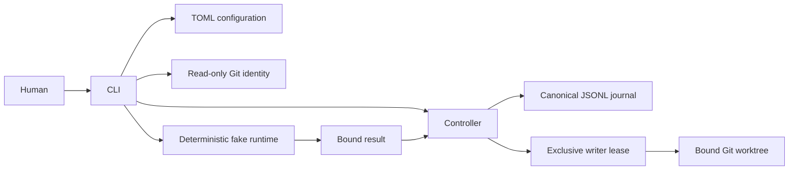
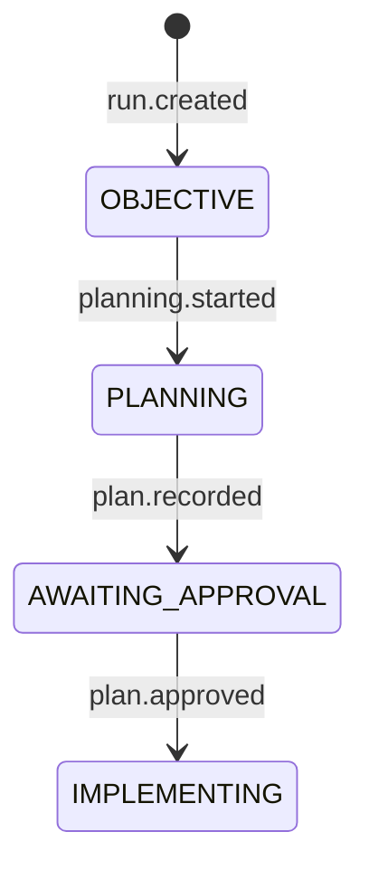

# System architecture

The implemented kernel has a finite CLI, strict TOML configuration, Git identity
observations, semantic controller, hash-chained journal, fake runtime and writer
workspace admission.
The controller validates transitions under the journal's exclusive append lock.

IMPLEMENTING admits workspace creation, exact approved file proposals and explicit
reconciliation. Verification execution follows this boundary.
Later phases add verification/repair/review and handoff with corresponding
specification and tests. The intended [language split](../adr/0001-language-split.md)
reserves immutable repository evidence and queries for Rust; no empty RI facade
is shown as an implemented component.

Canonical identity owns serialization. Runtime owns model/result contracts.
Journal owns byte integrity and exclusive append. Control owns semantic replay.
Repository discovery owns Git facts; configuration owns required check inputs.
None of those input providers grants effect authority.
