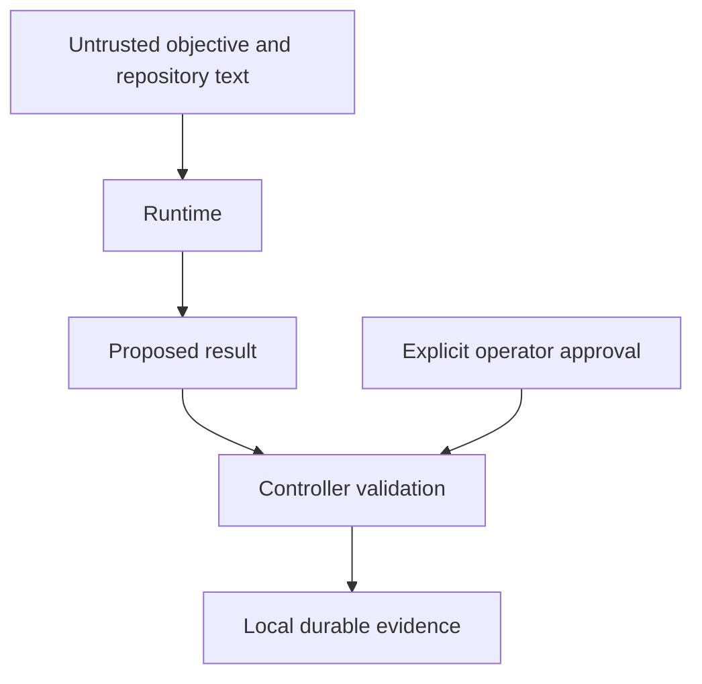

# Trust boundary

The initial fake runtime has no tools or process access. Repository text and
model results do not authorize effects. The controller only admits explicit
versioned events and exact plan approval. Unknown fields fail decoding.

Local journal and configuration paths currently assume a trusted operator-owned
filesystem. Hash chains detect altered bytes, but an attacker who can rewrite
the full chain can forge evidence. Actor labels are audit data, not authenticated
identities. Workspace admission now rejects link/reparse ancestors and hardlinked
files, checks reciprocal Git registration, and uses rooted file access. These
checks do not establish isolation against a hostile process with the same user
permissions. Source-effect admission and WorkerEnvironment qualification remain
separate work.

A Git worktree separates changes; it is not an OS security sandbox. Future
WorkerEnvironment capabilities must describe actual evidence. No container,
microVM, network boundary or external-effect sandbox exists in this milestone.
