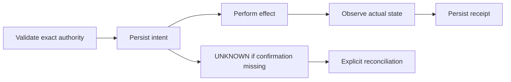

# Effect model v1

Scope: intent/authorization/receipt envelopes for filesystem mutation, commit,
push and draft PR creation. Each intent binds run, plan, repository and an exact
kind-specific input artifact hash. Unknown kinds and malformed hashes fail.
An authorization MUST name the exact intent ID and explicit operator actor.
Changing any input invalidates authorization.

The envelope package does not execute effects. A concrete adapter MUST validate
the referenced payload and current authority before persisting intent, executing,
observing actual state and persisting receipt. An envelope alone is insufficient
to execute. The [file-effects adapter](file-effects.md) implements this lifecycle
for regular files. The [local commit adapter](local-commit.md) also implements
execution and recovery. The [push contract and executor](git-push.md) are
implemented with controller admission and read-only reconciliation. Actual
process-interruption recovery and the draft-PR lifecycle remain incomplete.

This diagram is implemented for regular-file proposals, local commits and RI
lifecycle effects and local-fixture push execution. Draft-PR execution remains pending.

A missing receipt MUST classify as UNKNOWN. Receipts bind the intent and an
observation artifact; valid outcomes are CONFIRMED, NOT_APPLIED and UNKNOWN.
An observation hash is integrity, not proof of its semantics. Only the owning
adapter can establish that observed state confirms an effect. UNKNOWN MUST NOT
trigger automatic retry. Reconciliation requires fresh exact observation.

Concurrency is one authorized writer per change-set; journal append is serialized.
The future adapter must hold the writer lease across effect admission/execution.
v1 envelopes reject other versions. Operator actor labels are not authentication.
