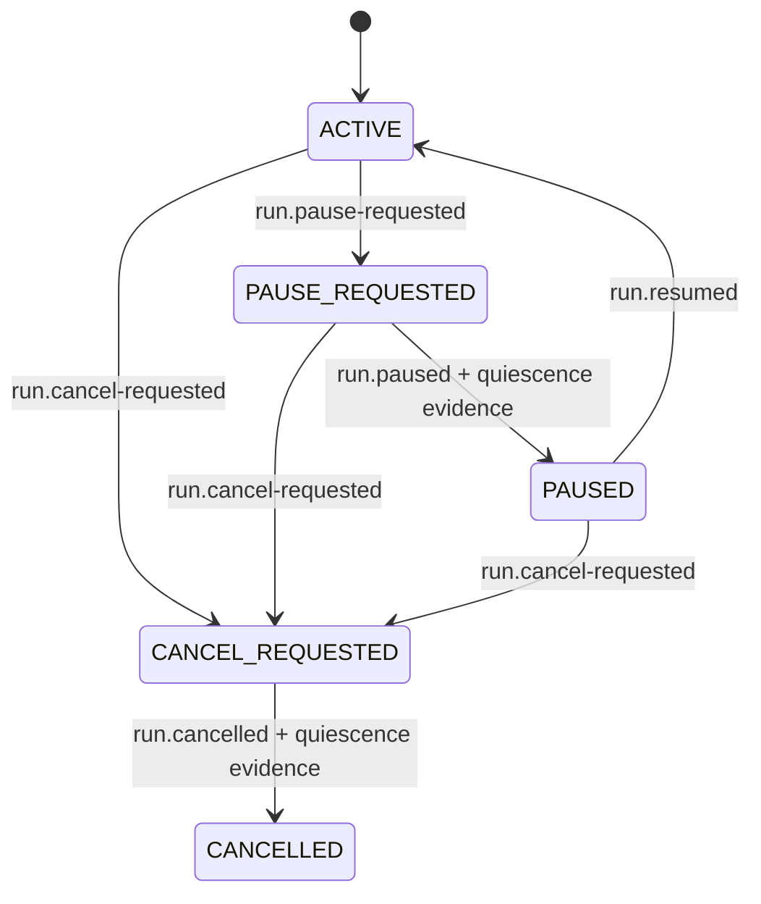

# Durable run lifecycle v1

Scope: operator pause-after-stage, resume and cancel are a durable overlay on
the existing controller run phase. They do not replace `OBJECTIVE`, `PLANNING`,
`IMPLEMENTING`, `VERIFYING` or the effect-specific state machines. The
controller journal remains the sole lifecycle authority.

A v1 history without lifecycle events replays as `ACTIVE`; no journal migration
is required. `CANCELLED` is terminal. A cancel request cannot be resumed. A pause
request must settle before resume, so resume cannot race a stage which is still
stopping.

## Durable events and operations

| Event | Controller operation | Required binding |
| --- | --- | --- |
| `run.pause-requested` | `RequestPause(path, actor, nonce)` | version, run ID, action `pause`, non-empty bounded actor and caller nonce |
| `run.paused` | `SettleLifecycle(path, actor, evidence, workloadsStopped)` | exact pause request ID, immediately prior controller journal head, quiescence attestation and exact unresolved-work list |
| `run.resumed` | `Resume(path, actor, nonce)` | exact settled pause request ID, actor and fresh caller nonce |
| `run.cancel-requested` | `RequestCancel(path, actor, nonce)` | version, run ID, action `cancel`, non-empty bounded actor and caller nonce |
| `run.cancelled` | `SettleLifecycle(path, actor, evidence, workloadsStopped)` | exact cancel request ID, immediately prior controller journal head, quiescence attestation and exact unresolved-work list |

Request IDs and resume IDs are domain-separated canonical hashes. Wall-clock
time does not authorize a transition. Exact retries of a request, settlement or
resume return the already replayed state without adding another event; changed
actor, nonce or evidence is a different request and does not inherit authority.
An append error requires journal readback.

`SettleLifecycle` does not signal, terminate or inspect a process. The caller
must provide a non-empty bounded evidence statement and explicitly attest that
the admitted workload and descendants stopped. `workloads_stopped=false` is
rejected. This follows the existing verification, producer and writer-lease
recovery boundary: process exit or context cancellation alone is not proof of
quiescence.

The settlement binds the exact previous controller event hash. A receipt built
before a concurrent reconciliation event is stale and fails. It also includes a
sorted, non-null list of controller-known unresolved work, including pending
model-access/runtime receipts, workspace/file/effect outcomes, verification,
commit/push/draft recovery and RI operations. Replay recomputes the list. It
rejects omission, insertion or reordering.

Unresolved work remains unresolved after `PAUSED` or `CANCELLED`. The lifecycle
receipt never changes an effect from `UNKNOWN`, admits an output, releases a
lease, declares a process dead or authorizes a retry. This permits cancellation
to finish after externally established quiescence while preserving the evidence
needed for later read-only reconciliation.

## Dispatch gate and reconciliation

Every controller event passes the lifecycle gate inside the same journal lock
which validates and appends it. After pause or cancel is requested, new runtime
and effect admissions fail closed. The current finite rejected set includes:

- planning and model-access starts/intents;
- generic `agent.dispatch-admitted` events which order provider and OpenCode
  runtime work before task-pool/access/provider admission;
- planner, explorer, writer and reviewer host intents;
- workspace, file and file-recovery intents;
- verification planning and process starts;
- commit, push and draft creation/recovery/lease intents;
- RI producer, publish, import, lexical and overlay intents;
- plan approval and unclassified future event kinds.

The finite reconciliation allowlist admits only lifecycle events and exact
receipts, observations or explicit closure evidence already understood by
controller replay. It includes `agent.dispatch-observed`, model-access terminal
receipts; host readiness,
startup and runtime observations; completed planner/role results; workspace and
file observations; verification observation/closure; commit, push and draft
observations; and RI observations/producer closure. A late admitted result may
advance the underlying run phase while the lifecycle remains paused or
cancelled. The gate still prevents the next stage from dispatching.

Provider and OpenCode routes append an exact `agent.dispatch-admitted` event to
the controller journal before task-pool acquisition, access reservation,
runtime journal creation or provider transport. A concurrent pause is therefore
ordered on the same journal: an admission before the request may settle, while
an admission after the request is rejected before runtime/effect dispatch. A
crash after admission but before the agent-tree node becomes `running` resumes
that same admission rather than creating a second one.

`RequireDispatchAllowed(snapshot)` remains the supplemental integration hook
for any future runtime route which sends work without first appending a
controller intent. A plain inspect/check followed by a downstream write is not
atomic with a concurrent pause request. Such a future route must hold the run
scheduler exclusion across the check and durable downstream admission, or add
an exact controller admission event first.

An agent dispatch may move from `UNKNOWN` to `succeeded` only through its same
invocation/admission identity and exact runtime result hash. The runtime adapter
must recover from its own journal without another provider send. Task-pool
capacity remains charged while dispatch is `UNKNOWN`; only the controller-bound
provider/model terminal receipt supplies the release hash.

Resume appends only `run.resumed`; it creates no model-access, runtime or effect
intent. Existing domain replay decides whether an admitted operation is terminal
or requires reconciliation. Resume therefore cannot turn an unknown dispatch
into a resend.

## Executed evidence

Local deterministic tests cover:

- old histories replaying `ACTIVE`, durable pause and explicit settlement;
- dispatch denial immediately after the request and reopening only after a
  settled pause plus exact resume;
- cancel retaining an unresolved planning stage while accepting its late exact
  result;
- terminal cancel rejecting plan approval and resume;
- settlement rejection for false quiescence, substituted journal head and a
  changed unresolved-work list;
- exact retry idempotency and the complete finite admission/reconciliation
  classification of current controller event kinds;
- crash after agent admission but before `running`, concurrent pause/admission
  ordering, a terminal receipt after cancellation, and no task-pool release for
  an `UNKNOWN` dispatch;
- CLI pause, settle, resume and cancel over a local fake-runtime fixture.

These tests do not prove OS process-tree quiescence, hosted cancellation or a
live provider recovery. Those require separately bound host/runtime evidence.
